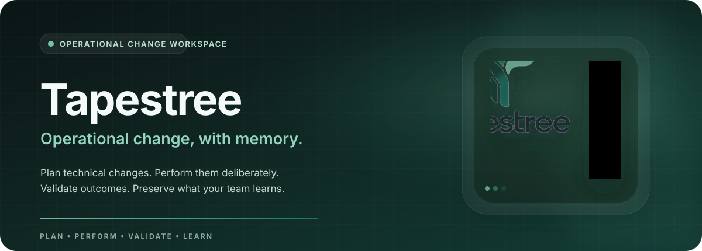
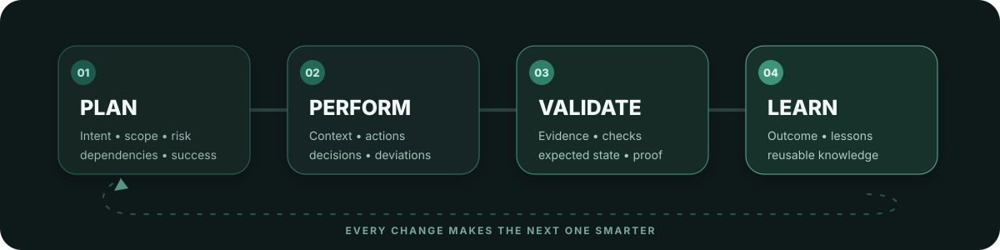
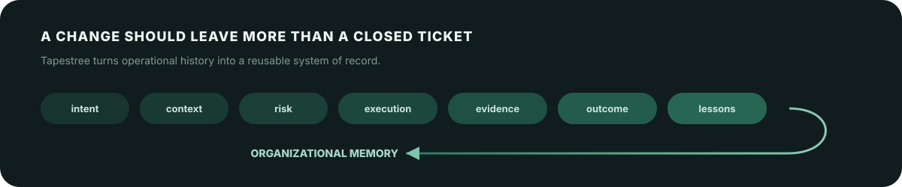
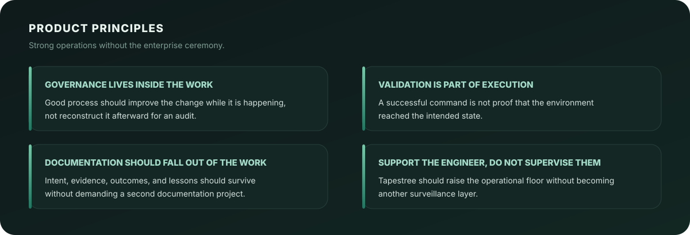

  

  
  
  

 

Every change leaves a trace.

Infrastructure changes constantly.

A policy is tightened. A server is upgraded. An identity rule changes. A deployment succeeds. Another one teaches you something.

The technical work happens, but the reasoning around it is often scattered across tickets, chat threads, shell history, screenshots, personal notes, and memory.

Tapestree is an operational change workspace built to keep that knowledge intact.

It helps technical teams plan, perform, validate, document, and learn from changes while the work is actually happening.

The goal is not more process. The goal is better operational memory.

 

The loop

  

Tapestree treats a technical change as a complete operational loop, not a form that gets approved and forgotten.

Plan what should happen and define success.
Perform the work with context available at the point of action.
Validate that the environment actually reached the intended state.
Learn from the result so the next change starts with more knowledge than the last one.

 

What survives the change

  

A completed change should answer more than what happened?

It should preserve why it happened, what was expected, what was actually done, how the result was verified, what changed along the way, and what the team should know next time.

That is the durable layer Tapestree is designed to build.

 

Built for the people running the systems

  
  
  
  
  
  
  

Tapestree is especially interested in teams operating complex environments without dedicated SRE, GRC, change management, or operational enablement functions.

The people making the changes should not need an enterprise bureaucracy around them to practice strong operations.

 

Product principles

  

 

What Tapestree is becoming

<table>
  <tr>
    <td width="50%" valign="top">
      <h3>Change workspace</h3>
      
A focused place to define, perform, and validate technical work without turning the task into ticket archaeology.

    </td>
    <td width="50%" valign="top">
      <h3>Operational memory</h3>
      
A durable record of decisions, evidence, outcomes, and lessons that becomes more useful as the environment evolves.

    </td>
  </tr>
  <tr>
    <td width="50%" valign="top">
      <h3>Governance by default</h3>
      
Good habits embedded into the workflow itself, so rigor does not depend on someone remembering to reconstruct the paperwork later.

    </td>
    <td width="50%" valign="top">
      <h3>Engineering support</h3>
      
Structure that helps administrators work with more confidence and consistency, without treating them as something to monitor.

    </td>
  </tr>
</table>

 

The organization

tapestre​ehq is where Tapestree is being built.

This organization will hold the application, supporting services, libraries, documentation, infrastructure, experiments, and public components that make up the product.

Tapestree is still in early product development. Architecture, workflows, and product boundaries will change as the idea is tested against real operational work.

<table>
  <tr>
    <td><b>Right now</b></td>
    <td>Building the product foundation and core change workflow.</td>
  </tr>
  <tr>
    <td><b>Next</b></td>
    <td>Turning completed changes into structured, searchable operational knowledge.</td>
  </tr>
  <tr>
    <td><b>North star</b></td>
    <td>Make strong operational practice feel like part of engineering work, not overhead attached to it.</td>
  </tr>
</table>

 

A small thesis

Technical environments accumulate history whether teams capture it or not.

Tapestree is built around the idea that the history should become an asset.

 

  

  <b>Tapestree</b> · Operational change, with memory.

